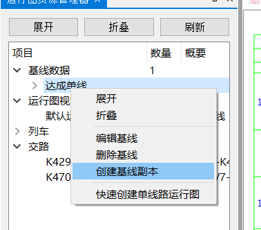
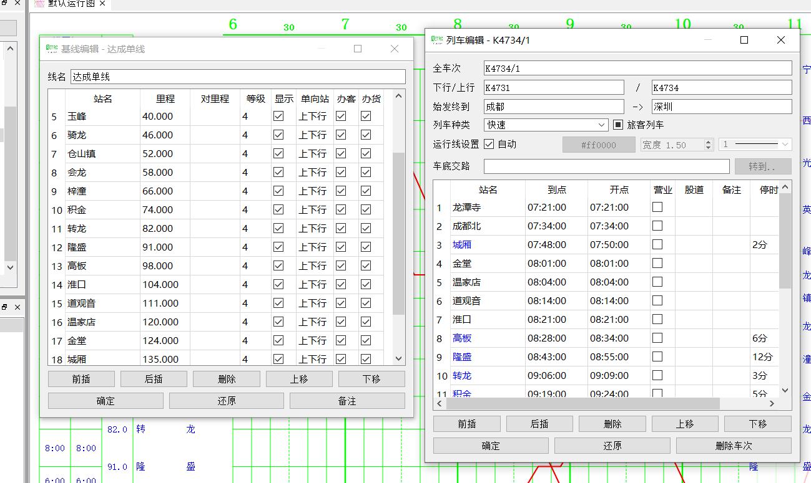

快速上手
--------

.. tip::
    推荐观看视频：《从pyETRC到qETRC操作逻辑变化简介》 https://www.bilibili.com/video/BV1334y1X7Wr/
    本视频对操作逻辑做了一整体介绍，特别推荐使用过pyETRC的用户观看。

程序主界面
~~~~~~~~~~

程序主界面如下图所示。

.. image:: /_static/img/tutorial/main.png
    :alt: 程序主界面

主要包含以下部分：

- 正中央占据最大空间的\ **运行图窗口**\ 。
- 窗口顶部、运行图窗口以上为 **工具栏** 。本软件采用Ribbon风格的工具栏，由\ `SARibbon <https://github.com/czyt1988/SARibbon/>`_\ 提供支持。其中：

    - 左上角按钮 :guilabel:`文件` 包含打开、保存等基本的文件操作。
    - :guilabel:`开始` 至 :guilabel:`显示` 四个页面为基本的 **工具栏页面** ，包含基本操作，在程序运行过程中始终显示。
    - 右侧带背景的 :guilabel:`运行图` :guilabel:`线路工具` 等选项卡为 **上下文页面** 或 **上下文选项卡** (context page) ，是针对运行图文件中某一特定元素（运行图页面、线路、列车等）的具体操作，程序启动时不显示，只有当选择到具体元素时，才显示。也可手动关闭。
    - 右上角有撤销、重做、关闭选项卡、关闭窗口等操作。

- 运行图窗口左右两侧为\ **停靠面板**\ （docked widget） 区域，用户可以自行开关窗口、移动位置等。默认情况下，启动时包含四个窗口：

    - 运行图资源管理器，运行图中所有数据元素的列表，详见下节。
    - 历史记录，包含目前执行的所有（可撤销的）操作列表。
    - 速览时刻、速览信息：当前选中车次的时刻表和重要的统计信息。
- 底部为状态栏，显示最近执行的操作（部分）

所有的停靠面板都可以拖动改变位置、悬浮或者关闭，例如下图所示

.. figure:: /_static/img/tutorial/ads.png
    :alt: 停靠面板操作

此功能由 `Qt-Advanced-Docking-System <https://github.com/githubuser0xFFFF/Qt-Advanced-Docking-System/>`_ 库提供支持，可参阅相关文档获得更多支持。
所有关闭的停靠面板皆可在工具栏中找到对应的开关，重新打开。

.. note:: 
    运行图窗口实质上也是一个停靠面板，支持拖动、关闭、悬浮等操作。

.. _sec_file_struct:

运行图文件结构
~~~~~~~~~~~~~~

在本文档中，一个\ **运行图文件**\ 是指一个由本软件直接打开、保存的、磁盘上的物理文件。运行图资源管理器以最清晰、简洁的方式展示了运行图文件的（逻辑）结构，如下图所示：

.. figure:: /_static/img/tutorial/struct.png
    :alt: 运行图资源管理器

主要包含：

（1）一组\ **线路**\ ，或者\ **基线**\ 。每条线路是指一段连续的铁路线路，原则上具有线性结构。一个运行图文件可以包含多条线路。每条线路包含如下数据：

- 线路\ **站表**\ ，或称里程表，给出每个站的站名、里程等基本信息。
- \ **标尺**\ ，或称区间运行时分标准，给出列车在线路每个区间运行的耗时。一条线路可以包含多套标尺，或不包含任何标尺。
- \ **天窗**\ ，规定线路每日检修时段。目前每条线路支持两套天窗数据，即综合维修天窗、综合施工天窗。

.. note::
    pyETRC中每个运行图文件只能有一条线路，但qETRC支持多条线路。如果打开由pyETRC保存的文件，可以正确读取线路；但如果用pyETRC打开本系统保存的多线路文件，则只能读取到第一条线路。

（2）一组\ **运行图页面**\ ，或称\ **运行图视窗**\ ，在不至于引起误会时也简称运行图。一个运行图页面对应程序中运行图窗口的一个页面，可以包含一条或多条线路。一条线路可以同时属于多个运行图页面，亦可不属于任何运行图页面。

.. note::
    pyETRC中没有运行图页面的概念。使用qETRC打开pyETRC保存的文件（或其他任何没有运行图页面的运行图文件），会自动以运行图中的线路创建一个默认运行图页面。

（3）一组\ **列车**\ 。每趟列车包含其车次、类型、时刻表等数据。

（4）一组\ **交路**\ 。交路描述车底的周转情况，是一组列车的有序序列。一趟列车只能属于至多一个交路，或不属于任何交路。

以上统称为运行图的\ **数据元素**\ 。在运行图资源管理器中右击或者双击数据元素或分类，可以执行添加、删除、编辑、创建副本等基本操作。

常用基本操作
~~~~~~~~~~~~

这里介绍一些本程序中最常用的基础操作，以便快速完成基本的功能；后续的文档也可能反复提到这些操作或者概念。对于更详细的功能，可以进一步参阅其他的文档。

基本数据元素的查看与编辑
^^^^^^^^^^^^^^^^^^^^^^^^^^

运行图的所有数据元素都可以在软件内查看和编辑。一般来说，每一种数据元素都提供了至少一种最基本的编辑方式，以表格形式列出全部数据，在数据合法的范围内，可以任意编辑，例如下图所示为运行图最基础的两种数据元素——线路里程表和列车时刻表的基本编辑页面。

.. tip::
    基本编辑页面通常是实现为停靠面板的，虽然默认情况下悬浮显示，但也可手动将其停靠在页面上。

通常有两种方式可以调出基本编辑页面：

- 在运行图资源管理器相应项目上双击，或者右击，找到对应的编辑选项。
- 通过某种方式选择到该数据元素（例如，在资源管理器或者其他管理窗口上选择相应的数据元素；点击车次运行线等），然后在上下文工具栏页面中找到相应的编辑功能。

以上简要介绍了运行图数据元素基本编辑的一般方法。关于数据元素的具体概念性规定，以及各种编辑器的具体说明，请参见\ :doc:`运行图数据管理</data/index>`\ 中的相应章节。

以上方式提供了对所有数据元素的最基本操作，原则上可以满足一切数据编辑的需要。然而逐个修订数据可能会比较麻烦，对于一些特定的应用场景，软件已经实现好更方便的功能，请参见\ :doc:`微调与修订</modify/index>`\ 及\ :doc:`运行图数据管理</data/index>`\ 。此外，还可以通过导入、导出数据的方式实现高效编辑，请参见\ :doc:`数据交互</interchange/index>`\ 。对于有一定开发能力的用户，也可以考虑借由pyETRC数据部分的代码，对数据进行外部编程，参见\ :doc:`数据的外部编程</interchange/index>`\ 。

车次选择
^^^^^^^^

在运行图中，单击任意车次运行线，可以\ **选中**\ 该车次，该车次有时被称为\ **当前车次**\ 。选中的车次运行线突出显示，同时在运行图左上角显示其完整车次；默认情况下，也会虚化运行图的其他部分（参见\ :doc:`运行图格式与控制</view/index>`\ ），如下图所示。

.. figure:: /_static/img/tutorial/select-train.png
    :alt: 选中车次

选中车次的同时，弹出 :guilabel:`列车审阅` :guilabel:`列车编辑` 两个工具栏上下文页面，可以进行针对该车次的操作。一些针对当前车次的操作（例如标尺对照，区间换线等）也可以执行。

选中车次的同时，该车次运行线所在的运行图页面、基线都将被设定为当前编辑的数据元素，可以在 :guilabel:`运行图` :guilabel:`线路工具` 上下文页面中编辑。

更多操作
^^^^^^^^^

更多的操作不再在这里一一说明，可以参阅本文档相应的章节。

一种快速熟悉本程序的方法时，将工具栏上的所有功能、选项逐一尝试一遍。如果有不明白的，可以（待本文档完成后）在本文档中搜索相应功能名称查找对应章节。

.. tip::
    qETRC中的绝大多数修改运行图的操作都支持撤销。如果操作出问题，可以及时撤销（快捷键 ``Ctrl`` + ``Z`` ）。对于部分因各种原因不支持撤销的操作，操作之前会有警告信息，请认真阅读并理解后再确定是否要执行。

    虽然如此，因为程序尚不完善，可能存在一些Bug，为了防止数据受到影响，请及时做好文件保存和备份。

    
常见问题解答
~~~~~~~~~~~~~

此处列出一些本软件使用过程中最常遇到的问题，以供新手快速查找问题。

\ **运行线中断、不完整、或者不显示运行线问题**\ 

省流版解决方案：将工具栏 :guilabel:`列车(3)` | :guilabel:`最大跨越站数` 设置成一充分大的数值。

此问题是输入的时刻表不完整（未给出部分通过站时刻）所致。qETRC为完整时刻表设计了更强大的功能，支持了同一列车有多段运行线的情况。对于同一列车在同一条线路的不同区段分段运行（中间一部分不在本线运行）的情况，前后两段作为独立运行线处理。
但若输入时刻表不完整，中间缺失较多车站，则会被系统误判为运行线应当在此处中断。 :guilabel:`最大跨越站数` 所示数值规定：若时刻表两个成功铺画的站之间有大于此数值的未铺画站，则判定为两段运行线。对于时刻表不完整的情况，应当将此数值设置到充分大，相当于禁用自动运行线分段的逻辑。

\ **交路图无法绘制问题**\ 

显然交路图必须知道交路中每一列车的始发、终到站时刻才能绘制。本系统中，列车有始发站、终到站的属性，但并不强制要求时刻表首站和末站必须为始发站、终到站；这是用于解决所用数据仅是一部分时刻表的情况。只有当交路中所有列车的时刻表首站和末站分别于所设置的始发站、终到站一致时，才可以绘制交路图。

后续阅读指南
~~~~~~~~~~~~

| 此部分待完成

* 文件格式，导入导出
* 基本数据管理
* 微调与修订
* 显示控制 （包括Ads和Ribbon相关）
* 分析
* 排图
* 路网管理
